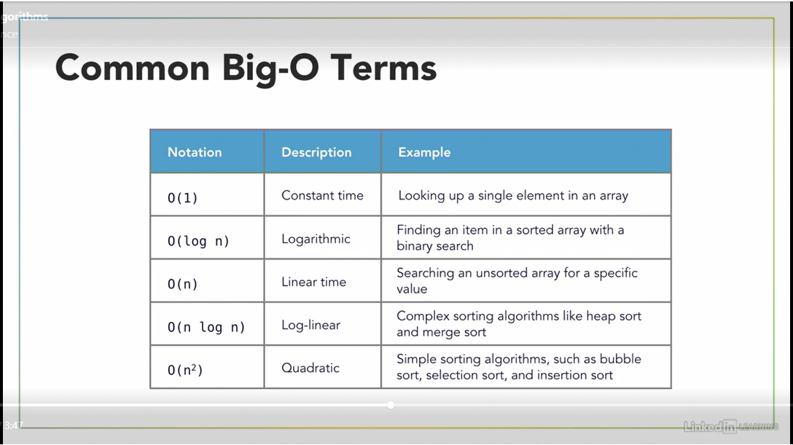

# LinkedIn Learning - Programming Foundations: Algorithms

## Algorithm Characteristics

* Algorithm complexity
    * Space: How much memory does it require?
    * Time: How much time does it take to complete?
* Inputs and Output
    * What does the algorithm accept, and what are the results.
* Classification
    * Serial/parallel
    * exact/approximate
    * deterministic/non-deterministic

## Common Algorithms

* Search algorithms
    * Find specific data in a structure (ie. a substring within a string)

* Sorting algorithms
    * Take a dataset and apply a sort order to it

* Computational algorithms
    * Given one set of data, calculate another 

* Collection algorithms
    * Work with collections of data (count specific items, navigate among data elements, filter out unwanted data, etc.)

# Example:  Euclid's Algorithm
* Find the greatest common denominator(GCD) of two integers.
1. For two integers a and b, where a > b, divide a by b
1. If the remainder, r, is 0, then stop: GCD is b
1. Otherwisem set a to b, b to r, and repeat at step 1 until r is 0

# Algorithm Performance
* Measure how an algorithm responds to dataset size
* Big-O Notation 
    * Classifies performance as the input size grows
    * "O" indicates the order of operation: time scale to perform an operation

    * Many algorithms and data structures have more than one O
        * Inserting data, searching for data, deleting data, etc.

        

# Recursion
When a function calls itself!

* Recursive functions need to have a breaking condition
    * prevents infinite loops and eventual crashes
* Each time the function is called, the old arguments are saved
    * This is called the "call stack"

# Sorting Data
Most modern languages have sorting built in

* Bubble Sort 
    * Linear
    * O(n2) performance time complexity
* Merge Sort
    * Divide and Conquer Algorithm
    * Breaks the dataset into individual pieces and merges them
    * Uses recursion to operate on datasets
    * Performs well on large sets of data
    * O(n log n) performance time complexity
* Quick Sort
    * Determine a Pivot Point and then divide the dataset in half
    * Uses recursion to operate on datasets

# Searching for Data 
    
* Linear Search - search all data in a dataset from the beginning until the search item is found (O n)
* Binary Search - when we know that the dataset is sorted, the data can be searched in sections by finding the midpoints and determining if the search item is greater or less than the value of the midpoint and then doing the same thing with the half of the dataset where the search item would be. (O log n)
* Determine if a list is sorted - (O n) check items one at a time to make sure that the next item in the list is greater than that item.  Once the next item is found to be less than the item, it is known that the list is not sorted.  
    * Use an advanced Python function called `all()` to simplify the process.

# Other Algorithms

* Unique filtering with a hash table - loop over the items in the list and by setting the value to the key of a hash table it will eliminate any duplicates.  Then simply identifying the keys within the new hash table, the unique items in the original dataset are identified.  (O n)
* Value counting with a hash table - loop over the items in the list and set the value of the key equal to a counter that is incremented if the key already exists.  Each unique occurrence is indentified by the keys and then the value holds the count of how many times that key appeared in the original list. (O n)
* Max value recursively - call a function that will continue to break the list down into intervals of two until it reaches the last item in the list.  When working with two items, determine the greater value and then compare it with the prior entries until all items are checked. (O n) 
